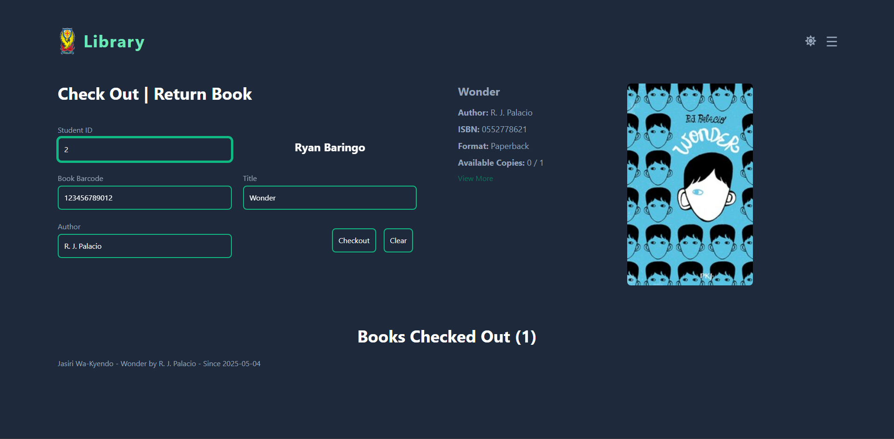
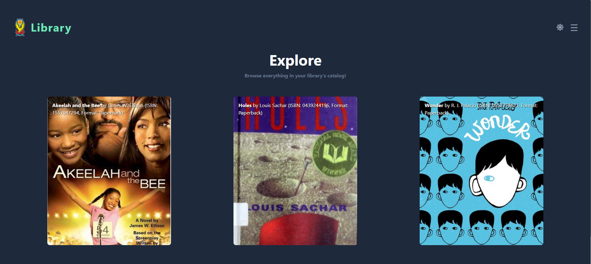
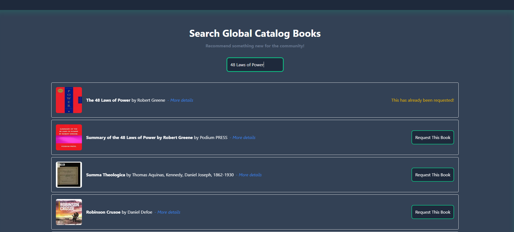
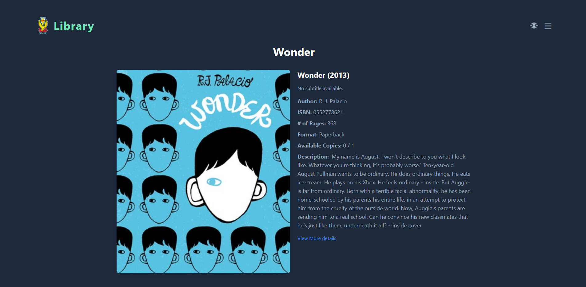

# 📚 Library POS

**Library POS** is a modern web-based Point of Sale (POS) system designed specifically for high school libraries. It streamlines the management of book inventories, student checkouts, and returns through an intuitive and responsive interface.

## 🌐 Live Demo

👉 [https://library-pos.vercel.app](https://library-pos.vercel.app)

Test Barcodes & Student IDs:

**Student IDs:** 1, 2
**Barcodes**: 123456789012, 123456789013, 123456789014

---

## 🖼️ Preview

### 📊 Dashboard View

### 🔍 Explore Page View

### 🔎 Search View

### 📖 Book Details View

---

## 🛠️ Tech Stack

* **Next.js** – React framework for server-side rendering and static site generation.
* **Tailwind CSS** – Utility-first CSS framework for rapid UI development.
* **Prisma** – Next-generation ORM for database access.
* **Supabase** – Open-source Firebase alternative for authentication and database management.

---

## 🚀 Features

* **User Authentication**: Secure login and session management using Supabase Auth.
* **Dashboard Overview**: Real-time insights into library operations, including active checkouts and returns.
* **Book Management**: Add, edit, and remove books with detailed information.
* **Search Functionality**: Quickly search for books by title, author, or ISBN.
* **Detailed Book View**: Access comprehensive information about each book, including availability and metadata.
* **Responsive Design**: Optimized for desktops, tablets, and mobile devices.